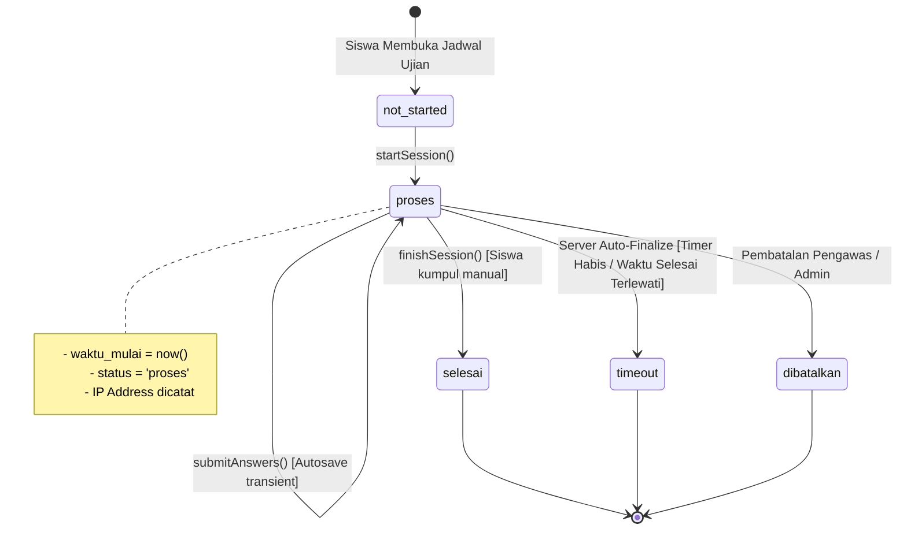

# CBT Attempt State Machine Specification — Sesi 5

## State Machine Diagram

## State Definitions & Transitions

| State | Deskripsi | Aksi yang Diizinkan | Transisi Selanjutnya |
| :--- | :--- | :--- | :--- |
| `not_started` | Ujian belum dimulai oleh siswa. | `startSession` | `proses` |
| `proses` | Siswa sedang mengerjakan ujian. Timer aktif. | `submitAnswers`, `finishSession` | `selesai`, `timeout`, `dibatalkan` |
| `selesai` | Sesi ujian telah dikumpulkan dan dinilai. | View Result (jika `tampilkan_nilai_langsung = true`) | Final State |
| `timeout` | Sesi berakhir otomatis karena batas waktu habis. | View Result | Final State |
| `dibatalkan` | Sesi dibatalkan oleh pengawas/guru. | None | Final State |
