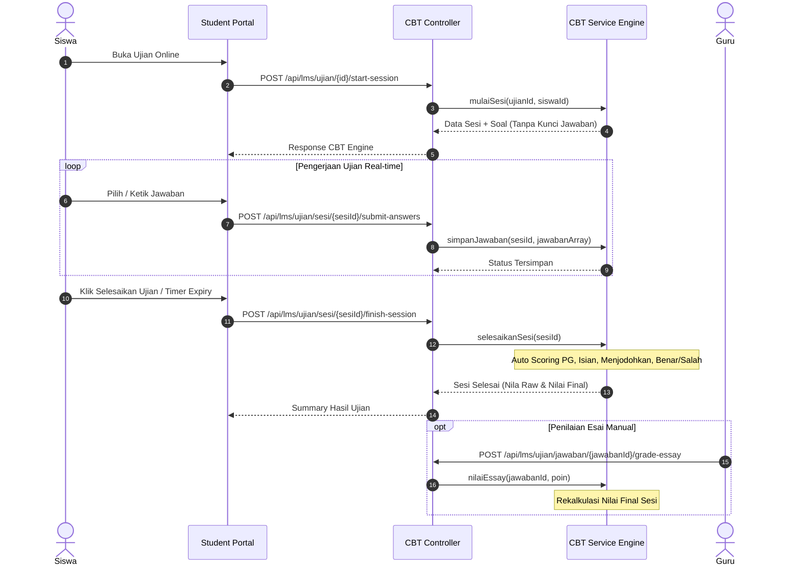

# CBT Online Examination Engine Flow — Sesi 5

## Overview
Modul CBT (`lms_ujian`, `lms_ujian_sesi`, `lms_jawaban_siswa`) menangani pengerjaan ujian online siswa secara interaktif dan real-time.

## CBT Lifecycle & Sequence Flow

## Fitur & Aturan CBT
1. **Server-Side Timer**: `sisa_waktu_detik` dihitung di server dari `waktu_mulai + durasi_menit`.
2. **Attempt Enforcement**: `max_attempt` diperiksa sebelum sesi baru dibuat.
3. **Auto Scoring**:
   - PG: `jawaban_dipilih === kunci_jawaban` -> `poin_didapat = soal.poin`.
   - Benar/Salah: `jawaban_dipilih === kunci_jawaban` -> `poin_didapat = soal.poin`.
   - Menjodohkan: `json_encode(jawaban) === json_encode(kunci)` -> `poin_didapat = soal.poin`.
   - Isian: Case-insensitive string match -> `poin_didapat = soal.poin`.
   - Esai: Penilaian manual guru via `gradeEssay`. Nilai final otomatis direkalkulasi.
