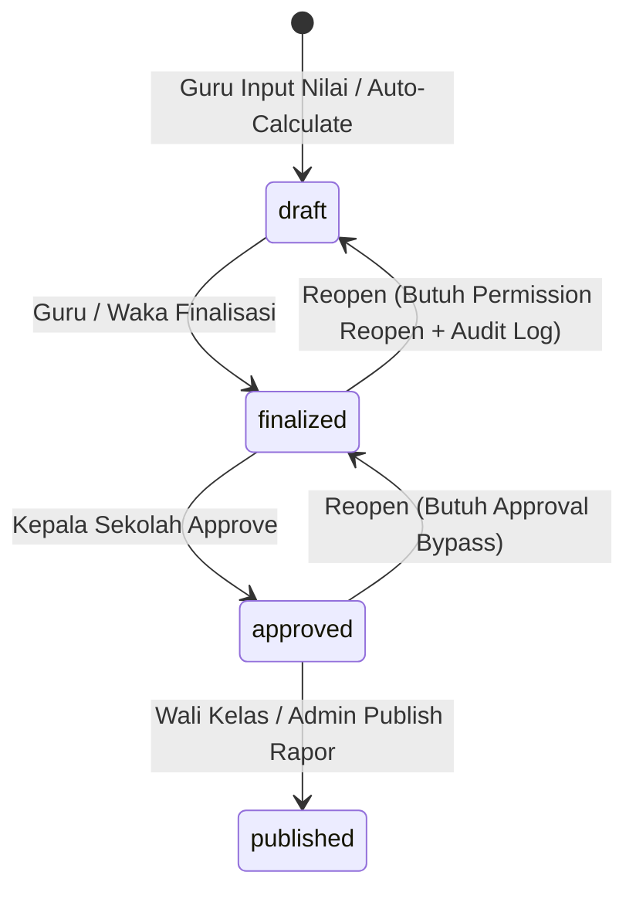

# Finalisasi Nilai & Lock Specification — Sesi 6

## Transisi Status Penilaian

## Security & Lock Rules
1. **Unlocking Protection**: Rekap nilai yang berstatus `finalized`, `approved`, atau `published` dikunci dari *manual override* tanpa hak akses khusus.
2. **Audit Logging**: Setiap tindakan pengubahan nilai, kalkulasi ulang, finalisasi, dan approval dicatat pada file log server (`[AUDIT LOG]`).
