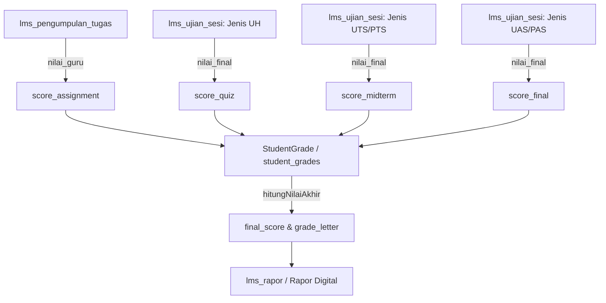

# Mapping Sumber Nilai (Grade Source Map) — Sesi 6

## Peta Komponen Nilai & Sumber Data

## Spesifikasi Kolom & Aturan Pengambilan

| Komponen Nilai | Tabel Sumber | Kolom Sumber | Filter Jenis | Aturan Agregasi |
| :--- | :--- | :--- | :--- | :--- |
| **score_assignment** | `lms_pengumpulan_tugas` | `nilai_guru` | N/A | Average per siswa & mapel |
| **score_quiz** | `lms_ujian_sesi` | `nilai_final` | `kisi_kisi.jenis_ujian = 'UH'` | Average per siswa & mapel |
| **score_midterm** | `lms_ujian_sesi` | `nilai_final` | `kisi_kisi.jenis_ujian IN ('UTS', 'PTS')` | Average per siswa & mapel |
| **score_final** | `lms_ujian_sesi` | `nilai_final` | `kisi_kisi.jenis_ujian IN ('UAS', 'PAS')` | Average per siswa & mapel |
| **final_score** | `student_grades` | Calculated | N/A | Weighted formula calculation |
