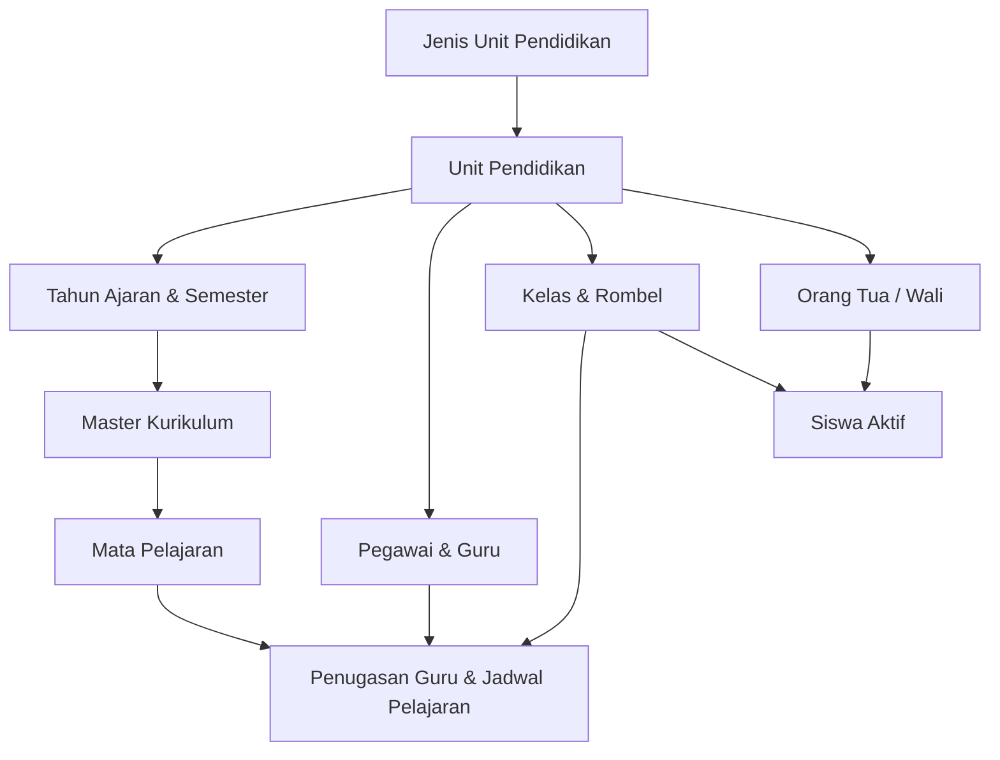
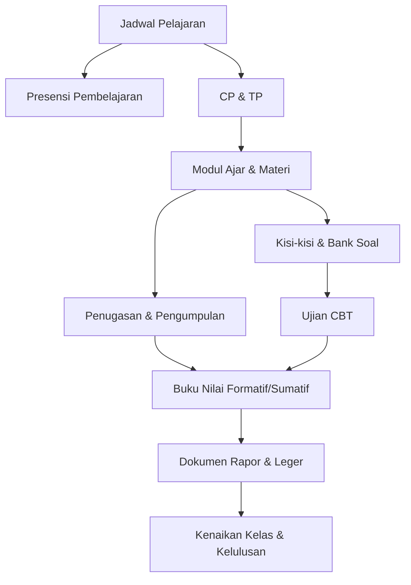
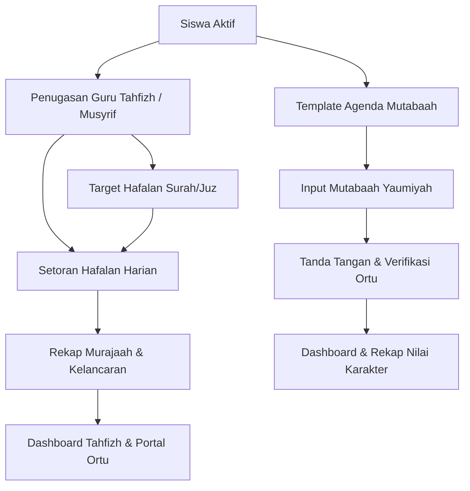
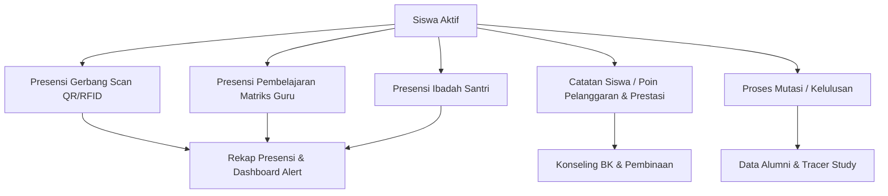

# MODULE DEPENDENCY MAP — SISTEM MANAJEMEN SEKOLAH TERPADU

Dokumen ini memetakan hierarki dan ketergantungan data antar-modul untuk memastikan integritas referensial dan urutan pengisian data master & transaksi.

---

## 1. ALUR MASTER DATA UTAMA

### Urutan Pengisian (Seed / Input Master):
1. **Jenis Unit Pendidikan** (`tbl_jenis_unit_pendidikan`)
2. **Unit Pendidikan** (`education_units`)
3. **Tahun Ajaran & Semester** (`academic_years`, `semesters`)
4. **Master Kurikulum** (`tbl_master_kurikulum`)
5. **Mata Pelajaran** (`subjects`)
6. **Pegawai & Guru** (`employees`, `users`, `roles`)
7. **Kelas & Rombel** (`tbl_kelas`)
8. **Orang Tua / Wali & Siswa** (`parents`, `students`, `parent_student`)
9. **Penugasan & Jadwal Pelajaran** (`lms_jadwal_pelajaran`)

---

## 2. ALUR AKADEMIK & LMS

---

## 3. ALUR TAHFIZH & MUTABAAH

---

## 4. ALUR PRESENSI & KESISWAAN

---

## 5. REKAPITULASI HIERARKI FOREIGN KEY

| Modul Anak | Foreign Key Primary | Modul Induk (Parent) | Syarat Deletion / Dependency |
|---|---|---|---|
| `education_units` | `jenis_unit_id` | `tbl_jenis_unit_pendidikan` | Restricted jika unit terpakai |
| `subjects` | `education_unit_id`, `kurikulum_id` | `education_units`, `tbl_master_kurikulum` | Soft delete |
| `employees` | `education_unit_id`, `user_id` | `education_units`, `users` | Soft delete |
| `tbl_kelas` | `education_unit_id`, `walikelas_id` | `education_units`, `employees` | Soft delete |
| `students` | `education_unit_id`, `kelas_id`, `parent_id` | `education_units`, `tbl_kelas`, `parents` | Soft delete |
| `lms_jadwal_pelajaran` | `education_unit_id`, `rombel_id`, `subject_id`, `teacher_id` | Unit, Kelas, Mapel, Guru | Cascade pada soft delete |
| `lms_presensi` | `jadwal_id`, `teacher_id` | `lms_jadwal_pelajaran`, `employees` | Finalisasi mengunci data |
| `tahfizh_deposits` | `student_id`, `teacher_id` | `students`, `employees` | Continuous log |
| `mutabaah_daily_records` | `student_id` | `students` | Unique per tanggal |
| `alumni` | `student_id` | `students` | Created on graduation |

STATUS DEPENDENCY: `VERIFIED — ALL PARENT-CHILD RELATIONS INTACT`
