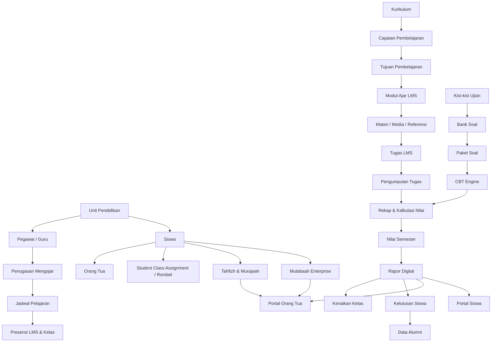

# SYSTEM INTEGRATION MAP — SIMSIT

Tanggal Update: 2026-08-06  
Status Sesi: Sesi 8 Finalization Passed  

---

## MAP INTEGRASI SISTEM UTAMA

```mermaid
graph TD
    Unit[Unit Pendidikan] --> Employee[Pegawai / Guru]
    Unit --> Student[Siswa]
    Student --> Parent[Orang Tua]
    Student --> ClassAssign[Student Class Assignment / Rombel]
    Employee --> TeacherAssign[Penugasan Mengajar]
    TeacherAssign --> Schedule[Jadwal Pelajaran]
    Schedule --> Attendance[Presensi LMS & Kelas]
    
    Curriculum[Kurikulum] --> CP[Capaian Pembelajaran]
    CP --> TP[Tujuan Pembelajaran]
    TP --> ModulAjar[Modul Ajar LMS]
    ModulAjar --> Material[Materi / Media / Referensi]
    Material --> Assignment[Tugas LMS]
    Assignment --> Submission[Pengumpulan Tugas]
    
    Blueprint[Kisi-kisi Ujian] --> QuestionBank[Bank Soal]
    QuestionBank --> ExamPackage[Paket Soal]
    ExamPackage --> CBTEngine[CBT Engine]
    
    Submission --> GradeEngine[Rekap & Kalkulasi Nilai]
    CBTEngine --> GradeEngine
    GradeEngine --> FinalGrade[Nilai Semester]
    FinalGrade --> ReportCard[Rapor Digital]
    
    ReportCard --> Promotion[Kenaikan Kelas]
    ReportCard --> Graduation[Kelulusan Siswa]
    Graduation --> Alumni[Data Alumni]
    
    Student --> Tahfizh[Tahfizh & Murajaah]
    Student --> Mutabaah[Mutabaah Enterprise]
    Tahfizh --> ParentPortal[Portal Orang Tua]
    Mutabaah --> ParentPortal
    ReportCard --> ParentPortal
    ReportCard --> StudentPortal[Portal Siswa]
```
